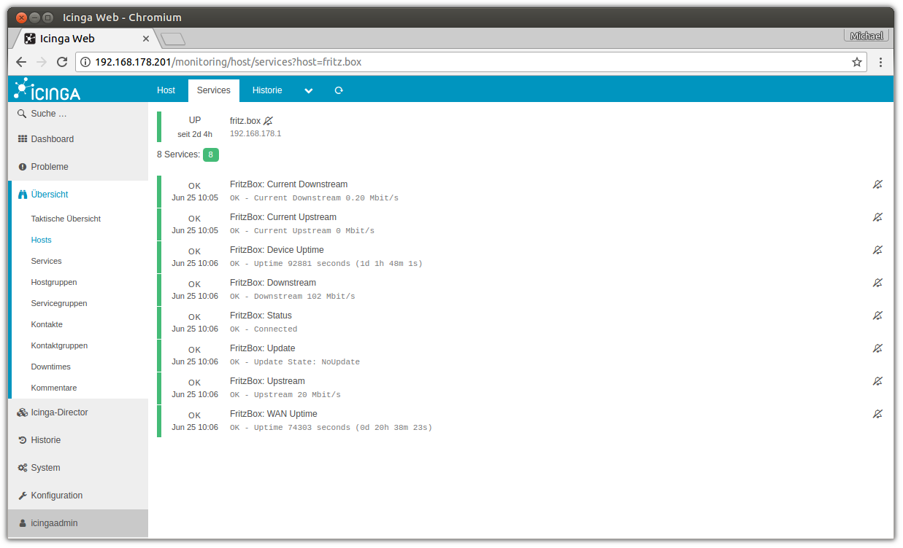

# check_tr64_fritz



This is a monitoring plugin for Icinga 2 to check the status of a Fritz!Box

## Requirements

You need following packages installed to use this check plugin.

- `bc`
- `curl`

## Installation

1. clone this Repository to an empty folder 
2. execute the `getSecurityPort` script, to find out your TR-064 SSL port
3. copy the `check_tr64_fritz` script to your Icinga 2 PluginDir 
4. write a [CheckCommand Definition](https://docs.icinga.com/icinga2/latest/doc/module/icinga2/chapter/monitoring-basics#check-commands)
5. create a new service in Icinga for your Fritz!Box and have fun :)

## Usage

#### getSecurityPort

```
getSecurityPort <HOST>

  <HOST> = IP of your Fritz!Box
```

The return value is your SSL port for TR-064.

#### check_tr64_fritz

```
usage: check_tr64_fritz -h <HOSTNAME> -p <PORT> -u <USERNAME> -P <PASSWORD> -f <FUNCTION> -w <WARNING> -c <CRITICAL>

  -h: IP-Adress or hostname from the Fritz!Box
      default = fritz.box

  -p: SSL-Port from the Fritz!Box
      default = 49443

  -u: Login Username for the Fritz!Box
      default = dslf-config

  -P: Login Password for the Fritz!Box

  -f: Function to check
      default = status

  -w: value where the warning state come into effect
      default = -1 / returns every time an OK state

  -c: value where the critical state come into effect
      default = -1 / return every time an OK state

Functions:

  status = Connection Status

  linkuptime = WAN link uptime

  uptime = device uptime

  downstream = useable downstream rate
               output in Mbit/s

  upstream = useable upstream rate
             output in Mbit/s

  update = get the update state

DEBUG:

  -d: prints debug information
```

The username and password are the same as for the web interface of your Fritz!Box. If you don't need a username for the login to your Fritz!Box leave the argument blank.

## Security

In fact that a pasword is transmitted over the network, this Script use SSL to communicate with the Fritz!Box.
To find out the port which is used for SSL TR-064, please use the script `getSecurityPort`

Make sure you are hiding password variables in Icinga Web 2.

1. login to your Icinga Web 2
2. go to `Configuration` -> `Modules` -> `monitoring` -> `Security`
3. make sure your custom password varibale is protected (defaults are `*pw*,*pass*,community`, if you named your custom variable `fritzbox_password` it will be protected with the defaults

## Hats off to

This script uses much of [FRITZ!Box mit Nagios überwachen](http://blog.gmeiners.net/2013/09/fritzbox-mit-nagios-uberwachen.html) and of an
article about [Fritz!Box and TR-064](http://heise.de/-2550500) from the heise publishing house.
