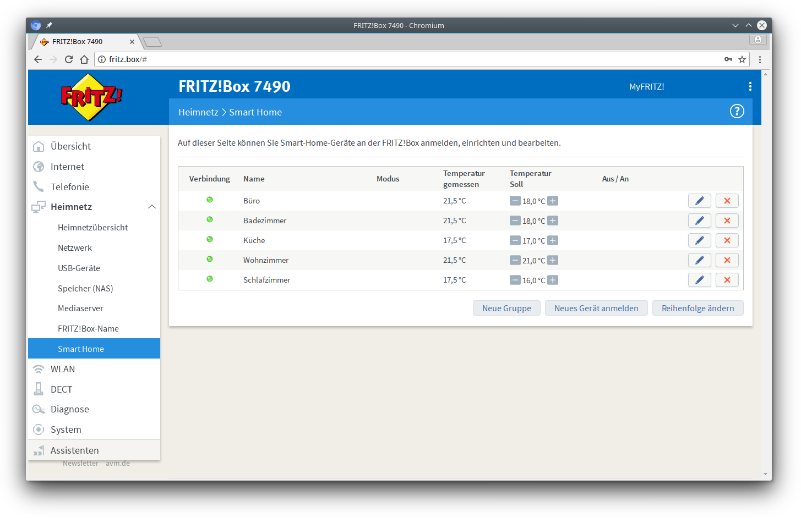

### Smart Home device data

Functions that collect data from smart home devices (such as the thermometers)
don't respond with live data, e.g. smart home device went offline and you
will still get an OK response. This is caused by the communication between the
Fritz!Box and the smart home devices, they exchange data every ~15 minutes,
therefore the smart home functions can not show the live data.

### Get the index for Smart Home devices

You can fetch the index number for your smart home device from your Fritz!Box
web interface. Log in to your Fritz!Box web interface and navigate to `Heimnetz`
-> `Smart Home`.

The index numbers are set by a descending order and always start with `0`. In the example screenshot you will
have the following index numbers.

| Name         | Index number |
| ---          | ---          |
| Büro         | 0            |
| Badezimmer   | 1            |
| Küche        | 2            |
| Wohnzimmer   | 3            |
| Schlafzimmer | 4            |
